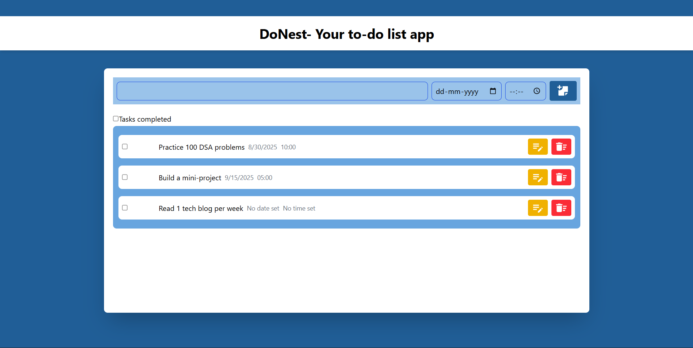

# DoNest - Your To-Do List App
## Overview

**DoNest** is a simple and elegant to-do list app built as part of my Web Development internship at SkillCraft Technology. It helps users manage their tasks efficiently by allowing them to:

- **Add** new tasks
- **Organize** tasks in lists
- **Mark** tasks as completed
- **Edit** tasks
- **Set Date & Time** for each task

The app is developed using **React** + **Vite** for fast development and hot reloading, **Tailwind CSS** for modern styling, and **React Icons** for intuitive visuals.

---

## Features

- **Add Tasks:** Quickly add new tasks to your list.
- **Organize Tasks:** View all tasks in a clean, organized UI.
- **Mark as Completed:** Check off tasks as you complete them.
- **Edit Tasks:** Easily modify task details.
- **Set Date & Time:** Assign a specific date and time for each task, or leave them unset.
- **Delete Tasks:** Remove tasks you no longer need.

---

## Screenshot

Below is a screenshot of the DoNest app interface:


<!-- Image 1 referenced as per the user instruction -->

---

## Tech Stack

- **React**
- **Vite**
- **Tailwind CSS**
- **React Icons**

---

## Getting Started

### Prerequisites

- Node.js (v18 or higher recommended)
- npm or yarn

### Installation

1. **Clone the repository:**
   ```bash
   git clone https://github.com/shivateja-droid/SCT_WD_4.git
   cd SCT_WD_4
   ```

2. **Install dependencies:**
   ```bash
   npm install
   # or
   yarn install
   ```

3. **Run the development server:**
   ```bash
   npm run dev
   # or
   yarn dev
   ```

4. **Open in browser:**
   Visit `http://localhost:5173` (default Vite port) to view the app.

---

## Folder Structure

```
SCT_WD_4/
├── src/
│   ├── components/
│   ├── assets/
│   ├── App.jsx
│   └── main.jsx
├── public/
│   └── ...
├── package.json
└── README.md
```

---

## Customization

- Modify or add new features in the `src/components/` folder.
- Update styles using Tailwind CSS classes.

---

## License

This project is for educational and portfolio purposes under the SkillCraft Technology internship program.

---

## Author

**Shiva Teja**  
Web Development Intern at SkillCraft Technology

---

## Acknowledgements

- SkillCraft Technology for the internship opportunity.
- React, Vite, Tailwind CSS, React Icons communities.
